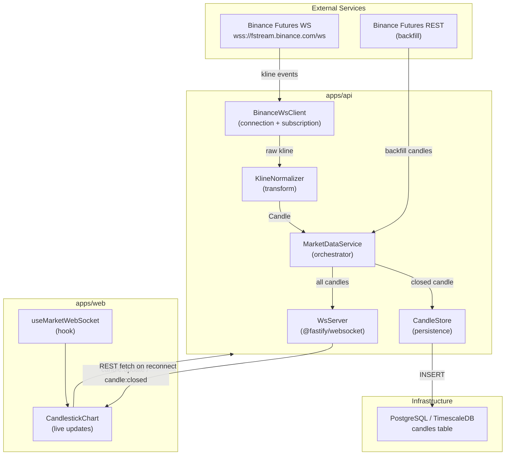
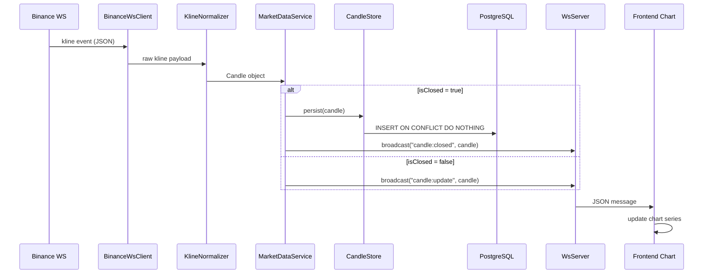
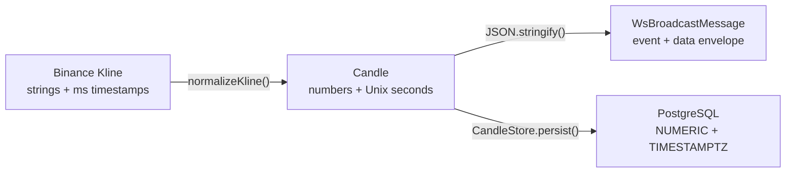

# Design Document: Phase 2 — Live Market Data

## Overview

Phase 2 adds real-time market data streaming to the ICT Forward Lab. The system connects to Binance Futures WebSocket streams, normalizes incoming kline data to the existing `Candle` interface, persists closed candles to PostgreSQL/TimescaleDB, and broadcasts live updates to connected frontend clients.

The architecture introduces five new modules that integrate with the existing Phase 1 foundation:

1. **BinanceWsClient** — Maintains persistent WebSocket connection to Binance Futures
2. **KlineNormalizer** — Converts Binance kline payloads to the `Candle` interface
3. **CandleStore** — Persists closed candles with idempotent upsert semantics
4. **WsServer** — Broadcasts real-time candle events to frontend clients via `@fastify/websocket`
5. **MarketDataService** — Orchestrates the above modules, handles reconnection and backfill

The frontend `CandlestickChart` component gains WebSocket connectivity for live chart updates without page refresh.

## Architecture



### Data Flow Sequence



### Key Design Decisions

1. **`@fastify/websocket` over standalone ws server** — Integrates directly with existing Fastify instance, shares port 3001, leverages Fastify lifecycle hooks for graceful shutdown.

2. **Separate BinanceWsClient from MarketDataService** — The WS client handles only connection/reconnection/subscription. The service orchestrates business logic (persist, broadcast, backfill). This enables testing each concern independently.

3. **EventEmitter pattern for internal communication** — BinanceWsClient emits `kline` events consumed by MarketDataService. This decouples the transport layer from business logic and simplifies testing with mock emitters.

4. **`INSERT ... ON CONFLICT DO NOTHING` for idempotency** — Leverages the existing unique constraint `(exchange, symbol, timeframe, open_time)` to make duplicate inserts safe. No need for pre-query checks.

5. **Backfill via Binance REST klines endpoint** — On reconnection, fetch `/fapi/v1/klines` from last known closed candle timestamp. This is simpler than maintaining a local gap-detection system.

6. **Single combined WS stream** — Subscribe to `btcusdt@kline_5m`, `btcusdt@kline_15m`, `btcusdt@kline_1h`, `btcusdt@kline_4h` in a single connection using the combined stream URL format.

## Components and Interfaces

### 1. BinanceWsClient (`apps/api/src/market-data/binance-ws-client.ts`)

Manages the WebSocket connection to Binance Futures.

```typescript
import { EventEmitter } from "events";
import WebSocket from "ws";

export interface BinanceWsClientOptions {
  url: string;  // wss://fstream.binance.com/ws
  streams: string[];  // ["btcusdt@kline_5m", "btcusdt@kline_15m", ...]
  reconnectBaseDelay: number;  // 1000ms
  reconnectMaxDelay: number;   // 60000ms
}

export interface BinanceKlineEvent {
  e: "kline";           // event type
  E: number;            // event time (ms)
  s: string;            // symbol (e.g., "BTCUSDT")
  k: {
    t: number;          // kline start time (ms)
    T: number;          // kline close time (ms)
    s: string;          // symbol
    i: string;          // interval (e.g., "5m")
    o: string;          // open price
    h: string;          // high price
    l: string;          // low price
    c: string;          // close price
    v: string;          // base asset volume
    x: boolean;         // is this kline closed?
    q: string;          // quote asset volume
    n: number;          // number of trades
  };
}

export declare interface BinanceWsClient {
  on(event: "kline", listener: (data: BinanceKlineEvent) => void): this;
  on(event: "connected", listener: () => void): this;
  on(event: "disconnected", listener: (code: number, reason: string) => void): this;
  on(event: "reconnecting", listener: (attempt: number) => void): this;
  on(event: "error", listener: (error: Error) => void): this;
}

export class BinanceWsClient extends EventEmitter {
  private ws: WebSocket | null = null;
  private reconnectAttempt = 0;
  private reconnectTimer: NodeJS.Timeout | null = null;
  private isClosing = false;

  constructor(private options: BinanceWsClientOptions) {
    super();
  }

  connect(): void { /* establish WS, subscribe, setup event handlers */ }
  disconnect(): void { /* clean close, prevent reconnect */ }
  
  private handleMessage(raw: string): void { /* parse, emit "kline" */ }
  private scheduleReconnect(): void { /* exponential backoff */ }
  
  getReconnectDelay(attempt: number): number {
    return Math.min(
      this.options.reconnectBaseDelay * Math.pow(2, attempt),
      this.options.reconnectMaxDelay
    );
  }
}
```

### 2. KlineNormalizer (`apps/api/src/market-data/kline-normalizer.ts`)

Pure function module that transforms Binance kline events to the `Candle` interface.

```typescript
import type { Candle } from "@ict-forward-lab/core";
import type { BinanceKlineEvent } from "./binance-ws-client";

export interface NormalizationResult {
  candle: Candle;
  symbol: string;
  timeframe: string;
}

/**
 * Normalize a Binance kline event to the application's Candle interface.
 * Returns null if the event is malformed.
 */
export function normalizeKline(event: BinanceKlineEvent): NormalizationResult | null {
  if (!event || !event.k || event.e !== "kline") {
    return null;
  }

  const k = event.k;
  
  // Validate required fields
  if (typeof k.t !== "number" || typeof k.x !== "boolean") {
    return null;
  }
  if (!k.o || !k.h || !k.l || !k.c || !k.v) {
    return null;
  }

  const open = Number(k.o);
  const high = Number(k.h);
  const low = Number(k.l);
  const close = Number(k.c);
  const volume = Number(k.v);

  // Reject NaN conversions
  if ([open, high, low, close, volume].some(isNaN)) {
    return null;
  }

  return {
    candle: {
      time: Math.floor(k.t / 1000),  // ms → Unix seconds
      open,
      high,
      low,
      close,
      volume,
      isClosed: k.x,
    },
    symbol: event.s,
    timeframe: k.i,
  };
}
```

### 3. CandleStore (`apps/api/src/market-data/candle-store.ts`)

Handles persistence of closed candles with idempotent semantics.

```typescript
import type { Pool } from "pg";
import type { Candle } from "@ict-forward-lab/core";

export interface CandleStoreOptions {
  pool: Pool;
  exchange: string;  // "binance"
}

export class CandleStore {
  constructor(private options: CandleStoreOptions) {}

  /**
   * Persist a closed candle. Returns true if inserted, false if already existed.
   * Only persists candles where isClosed === true (no-repaint rule).
   */
  async persist(candle: Candle, symbol: string, timeframe: string): Promise<boolean> {
    if (!candle.isClosed) return false;

    const openTime = new Date(candle.time * 1000).toISOString();
    // Estimate close time from timeframe
    const closeTime = new Date((candle.time + timeframeToDuration(timeframe)) * 1000).toISOString();

    const result = await this.options.pool.query(
      `INSERT INTO candles (exchange, symbol, timeframe, open_time, close_time, open, high, low, close, volume, is_closed)
       VALUES ($1, $2, $3, $4, $5, $6, $7, $8, $9, $10, $11)
       ON CONFLICT (exchange, symbol, timeframe, open_time) DO NOTHING`,
      [
        this.options.exchange,
        symbol.toUpperCase(),
        timeframe,
        openTime,
        closeTime,
        candle.open,
        candle.high,
        candle.low,
        candle.close,
        candle.volume,
        true,
      ]
    );

    return (result.rowCount ?? 0) > 0;
  }

  /**
   * Get the timestamp of the last persisted closed candle for a given symbol/timeframe.
   */
  async getLastCandleTime(symbol: string, timeframe: string): Promise<number | null> {
    const result = await this.options.pool.query(
      `SELECT open_time FROM candles 
       WHERE exchange = $1 AND symbol = $2 AND timeframe = $3 AND is_closed = true
       ORDER BY open_time DESC LIMIT 1`,
      [this.options.exchange, symbol.toUpperCase(), timeframe]
    );

    if (result.rows.length === 0) return null;
    return Math.floor(new Date(result.rows[0].open_time).getTime() / 1000);
  }
}

/** Convert timeframe string to duration in seconds */
export function timeframeToDuration(tf: string): number {
  const map: Record<string, number> = {
    "1m": 60, "5m": 300, "15m": 900,
    "1h": 3600, "4h": 14400,
  };
  return map[tf] ?? 300;
}
```

### 4. WsServer (`apps/api/src/market-data/ws-server.ts`)

Server-side WebSocket broadcasting using `@fastify/websocket`.

```typescript
import type { FastifyInstance } from "fastify";
import type { WebSocket } from "ws";
import type { Candle } from "@ict-forward-lab/core";

export interface WsBroadcastMessage {
  event: "candle:update" | "candle:closed";
  data: {
    symbol: string;
    timeframe: string;
    candle: Candle;
  };
}

export class WsServer {
  private clients: Set<WebSocket> = new Set();

  constructor(private fastify: FastifyInstance) {}

  /**
   * Register the /ws route with @fastify/websocket
   */
  register(): void {
    this.fastify.get("/ws", { websocket: true }, (socket, request) => {
      this.clients.add(socket);
      this.fastify.log.info(`WS client connected (total: ${this.clients.size})`);

      socket.on("close", () => {
        this.clients.delete(socket);
        this.fastify.log.info(`WS client disconnected (total: ${this.clients.size})`);
      });

      socket.on("error", (err) => {
        this.fastify.log.warn(`WS client error: ${err.message}`);
        this.clients.delete(socket);
      });
    });
  }

  /**
   * Broadcast a candle event to all connected clients.
   */
  broadcast(event: "candle:update" | "candle:closed", candle: Candle, symbol: string, timeframe: string): void {
    const message: WsBroadcastMessage = {
      event,
      data: { symbol, timeframe, candle },
    };

    const payload = JSON.stringify(message);

    for (const client of this.clients) {
      if (client.readyState === client.OPEN) {
        client.send(payload);
      }
    }
  }

  getClientCount(): number {
    return this.clients.size;
  }
}
```

### 5. MarketDataService (`apps/api/src/market-data/market-data-service.ts`)

Orchestrates all market data components.

```typescript
import type { Pool } from "pg";
import type { FastifyInstance } from "fastify";
import { BinanceWsClient, BinanceKlineEvent } from "./binance-ws-client";
import { normalizeKline } from "./kline-normalizer";
import { CandleStore } from "./candle-store";
import { WsServer } from "./ws-server";

export interface MarketDataServiceOptions {
  binanceWsUrl: string;
  symbol: string;
  timeframes: string[];
  pool: Pool;
  fastify: FastifyInstance;
}

export class MarketDataService {
  private wsClient: BinanceWsClient;
  private candleStore: CandleStore;
  private wsServer: WsServer;

  constructor(private options: MarketDataServiceOptions) {
    const streams = options.timeframes.map(
      (tf) => `${options.symbol.toLowerCase()}@kline_${tf}`
    );

    this.wsClient = new BinanceWsClient({
      url: options.binanceWsUrl,
      streams,
      reconnectBaseDelay: 1000,
      reconnectMaxDelay: 60000,
    });

    this.candleStore = new CandleStore({
      pool: options.pool,
      exchange: "binance",
    });

    this.wsServer = new WsServer(options.fastify);
  }

  async start(): Promise<void> {
    this.wsServer.register();
    this.setupEventHandlers();
    this.wsClient.connect();
  }

  async stop(): Promise<void> {
    this.wsClient.disconnect();
  }

  private setupEventHandlers(): void {
    this.wsClient.on("kline", (event: BinanceKlineEvent) => {
      this.handleKline(event);
    });

    this.wsClient.on("connected", () => {
      this.handleReconnect();
    });
  }

  private async handleKline(event: BinanceKlineEvent): Promise<void> {
    const result = normalizeKline(event);
    if (!result) return;

    const { candle, symbol, timeframe } = result;

    if (candle.isClosed) {
      await this.candleStore.persist(candle, symbol, timeframe);
      this.wsServer.broadcast("candle:closed", candle, symbol, timeframe);
    } else {
      this.wsServer.broadcast("candle:update", candle, symbol, timeframe);
    }
  }

  private async handleReconnect(): Promise<void> {
    for (const tf of this.options.timeframes) {
      await this.backfill(this.options.symbol, tf);
    }
  }

  private async backfill(symbol: string, timeframe: string): Promise<void> {
    const lastTime = await this.candleStore.getLastCandleTime(symbol, timeframe);
    if (!lastTime) return;

    // Fetch from Binance REST API
    const startTime = (lastTime + 1) * 1000; // next ms after last candle
    const url = `https://fapi.binance.com/fapi/v1/klines?symbol=${symbol}&interval=${timeframe}&startTime=${startTime}&limit=1000`;

    try {
      const response = await fetch(url);
      if (!response.ok) throw new Error(`Backfill HTTP ${response.status}`);
      
      const klines = await response.json() as unknown[][];
      
      for (const k of klines) {
        const candle = restKlineToCandle(k);
        if (candle && candle.isClosed) {
          await this.candleStore.persist(candle, symbol, timeframe);
          this.wsServer.broadcast("candle:closed", candle, symbol, timeframe);
        }
      }
    } catch (err) {
      this.options.fastify.log.error(`Backfill failed for ${symbol}/${timeframe}: ${err}`);
    }
  }
}

/** Convert Binance REST kline array to Candle */
function restKlineToCandle(k: unknown[]): Candle | null {
  if (!Array.isArray(k) || k.length < 11) return null;
  return {
    time: Math.floor(Number(k[0]) / 1000),
    open: Number(k[1]),
    high: Number(k[2]),
    low: Number(k[3]),
    close: Number(k[4]),
    volume: Number(k[5]),
    isClosed: true, // REST klines are always closed
  };
}
```

### 6. Frontend WebSocket Hook (`apps/web/hooks/useMarketWebSocket.ts`)

Custom React hook for WebSocket connectivity.

```typescript
"use client";

import { useEffect, useRef, useCallback, useState } from "react";
import type { Candle } from "@ict-forward-lab/core";

export type ConnectionStatus = "connecting" | "connected" | "disconnected";

export interface WsMessage {
  event: "candle:update" | "candle:closed";
  data: {
    symbol: string;
    timeframe: string;
    candle: Candle;
  };
}

interface UseMarketWebSocketOptions {
  url: string;
  symbol: string;
  timeframe: string;
  onCandleUpdate?: (candle: Candle) => void;
  onCandleClosed?: (candle: Candle) => void;
}

export function useMarketWebSocket(options: UseMarketWebSocketOptions) {
  const { url, symbol, timeframe, onCandleUpdate, onCandleClosed } = options;
  const wsRef = useRef<WebSocket | null>(null);
  const reconnectAttemptRef = useRef(0);
  const [status, setStatus] = useState<ConnectionStatus>("disconnected");

  const connect = useCallback(() => {
    setStatus("connecting");
    const ws = new WebSocket(url);

    ws.onopen = () => {
      setStatus("connected");
      reconnectAttemptRef.current = 0;
    };

    ws.onmessage = (event) => {
      const msg: WsMessage = JSON.parse(event.data);
      if (msg.data.symbol !== symbol || msg.data.timeframe !== timeframe) return;

      if (msg.event === "candle:update") {
        onCandleUpdate?.(msg.data.candle);
      } else if (msg.event === "candle:closed") {
        onCandleClosed?.(msg.data.candle);
      }
    };

    ws.onclose = () => {
      setStatus("disconnected");
      scheduleReconnect();
    };

    ws.onerror = () => {
      ws.close();
    };

    wsRef.current = ws;
  }, [url, symbol, timeframe, onCandleUpdate, onCandleClosed]);

  const scheduleReconnect = useCallback(() => {
    const delay = getReconnectDelay(reconnectAttemptRef.current);
    reconnectAttemptRef.current++;
    setTimeout(connect, delay);
  }, [connect]);

  useEffect(() => {
    connect();
    return () => {
      wsRef.current?.close();
    };
  }, [connect]);

  return { status };
}

export function getReconnectDelay(attempt: number): number {
  return Math.min(1000 * Math.pow(2, attempt), 60000);
}
```

### 7. Message Protocol Types (`packages/core/src/types/ws-messages.ts`)

Shared protocol types for WebSocket communication.

```typescript
import type { Candle } from "./candle";

export type WsEventType = "candle:update" | "candle:closed";

export interface WsCandleMessage {
  event: WsEventType;
  data: {
    symbol: string;
    timeframe: string;
    candle: Candle;
  };
}

/**
 * Serialize a WS message ensuring numeric fields stay as numbers.
 */
export function serializeWsMessage(message: WsCandleMessage): string {
  return JSON.stringify(message);
}

/**
 * Parse a raw WS message string into a typed message.
 * Returns null if parsing fails or structure is invalid.
 */
export function parseWsMessage(raw: string): WsCandleMessage | null {
  try {
    const parsed = JSON.parse(raw);
    if (!parsed.event || !parsed.data || !parsed.data.candle) return null;
    return parsed as WsCandleMessage;
  } catch {
    return null;
  }
}
```

## Data Models

### Binance Kline Event (Input)

The raw message from Binance Futures WebSocket:

```json
{
  "e": "kline",
  "E": 1700000000123,
  "s": "BTCUSDT",
  "k": {
    "t": 1700000000000,
    "T": 1700000299999,
    "s": "BTCUSDT",
    "i": "5m",
    "o": "37250.50",
    "h": "37300.00",
    "l": "37200.00",
    "c": "37280.30",
    "v": "125.700",
    "x": false,
    "q": "4691234.50",
    "n": 1234
  }
}
```

### Normalized Candle (Internal)

After normalization to the existing `Candle` interface:

```json
{
  "time": 1700000000,
  "open": 37250.5,
  "high": 37300.0,
  "low": 37200.0,
  "close": 37280.3,
  "volume": 125.7,
  "isClosed": false
}
```

### WebSocket Broadcast Message (Output)

Message sent to frontend clients:

```json
{
  "event": "candle:update",
  "data": {
    "symbol": "BTCUSDT",
    "timeframe": "5m",
    "candle": {
      "time": 1700000000,
      "open": 37250.5,
      "high": 37300.0,
      "low": 37200.0,
      "close": 37280.3,
      "volume": 125.7,
      "isClosed": false
    }
  }
}
```

### Data Transformation Pipeline



### Timeframe Stream Mapping

| Timeframe | Binance Stream Name | Duration (s) |
|-----------|-------------------|--------------|
| 5m  | `btcusdt@kline_5m`  | 300  |
| 15m | `btcusdt@kline_15m` | 900  |
| 1h  | `btcusdt@kline_1h`  | 3600 |
| 4h  | `btcusdt@kline_4h`  | 14400 |

## Correctness Properties

*A property is a characteristic or behavior that should hold true across all valid executions of a system — essentially, a formal statement about what the system should do. Properties serve as the bridge between human-readable specifications and machine-verifiable correctness guarantees.*

### Property 1: Kline normalization produces valid Candle

*For any* well-formed `BinanceKlineEvent` with valid numeric string fields and a millisecond timestamp, `normalizeKline()` SHALL produce a `Candle` object where `time` equals `Math.floor(kline.k.t / 1000)`, all price/volume fields equal `Number(stringValue)`, and `isClosed` equals `kline.k.x`.

**Validates: Requirements 2.1, 2.2, 2.3, 2.4**

### Property 2: Malformed kline events are rejected without throwing

*For any* input object that is missing required kline fields, has non-numeric price strings, or has an incorrect event type, `normalizeKline()` SHALL return `null` without throwing an exception.

**Validates: Requirements 2.5**

### Property 3: Exponential backoff delay calculation

*For any* non-negative integer attempt number `n`, `getReconnectDelay(n)` SHALL return `Math.min(1000 * 2^n, 60000)` — starting at 1 second and capping at 60 seconds.

**Validates: Requirements 1.4, 5.4**

### Property 4: Only closed candles are persisted

*For any* `Candle` object where `isClosed` is `false`, calling `CandleStore.persist()` SHALL not insert any record into the database and SHALL return `false`.

**Validates: Requirements 3.2**

### Property 5: Idempotent candle insertion

*For any* closed `Candle` object with a given `(exchange, symbol, timeframe, open_time)` tuple, calling `CandleStore.persist()` multiple times with the same candle SHALL result in exactly one database record and SHALL not throw an error on subsequent calls.

**Validates: Requirements 3.3, 7.3**

### Property 6: Broadcast reaches all connected clients

*For any* set of connected WebSocket clients and any candle event (update or closed), calling `WsServer.broadcast()` SHALL deliver the message to every client whose `readyState` is `OPEN`.

**Validates: Requirements 4.2, 4.3**

### Property 7: Message protocol conformance

*For any* broadcast message produced by `WsServer`, the serialized JSON SHALL contain a top-level `event` field (one of `"candle:update"` or `"candle:closed"`), a `data` field containing `symbol` (string), `timeframe` (string), and a complete `candle` object with all Candle interface fields.

**Validates: Requirements 4.5, 6.1, 6.2, 6.3, 6.4**

### Property 8: Numeric values remain numbers in serialized messages

*For any* `Candle` object with numeric price and volume fields, serializing it within a `WsBroadcastMessage` via `JSON.stringify` SHALL produce JSON where `open`, `high`, `low`, `close`, and `volume` are JSON number tokens (not strings).

**Validates: Requirements 6.5**

## Error Handling

### BinanceWsClient Errors

| Scenario | Behavior |
|----------|----------|
| Initial connection failure | Emit `error` event, schedule reconnect with backoff |
| Connection drop (code 1006) | Emit `disconnected`, schedule reconnect with backoff |
| Malformed message from Binance | Log warning, skip message, continue processing |
| Max reconnect delay reached | Continue retrying at 60s intervals, log at warn level |
| Intentional shutdown (`disconnect()`) | Close cleanly, suppress reconnect attempts |

### KlineNormalizer Errors

| Scenario | Behavior |
|----------|----------|
| Missing `k` field | Return `null`, caller logs warning |
| NaN from Number() conversion | Return `null`, caller logs warning |
| Unexpected event type (not "kline") | Return `null` silently (filtered) |

### CandleStore Errors

| Scenario | Behavior |
|----------|----------|
| Database connection lost | Throw error, caught by MarketDataService, logged |
| Duplicate insert (ON CONFLICT) | Return `false`, no error |
| Invalid data types | PostgreSQL rejects insert, error propagated and logged |

### WsServer Errors

| Scenario | Behavior |
|----------|----------|
| Client send fails (broken pipe) | Remove client from Set, log at debug level |
| Invalid upgrade request | Fastify rejects with 400 |
| Message serialization failure | Log error, skip broadcast for that message |

### Frontend WebSocket Errors

| Scenario | Behavior |
|----------|----------|
| Connection refused | Set status to "disconnected", schedule reconnect |
| Connection dropped | Set status to "disconnected", schedule reconnect, show indicator |
| Invalid message format | Log warning, ignore message |
| REST backfill failure | Log error, chart continues with available data |

## Testing Strategy

### Unit Tests

Focus on specific examples, edge cases, and integration points:

- **KlineNormalizer**: Known Binance kline payloads → expected Candle output
- **KlineNormalizer edge cases**: Empty strings, null fields, missing `k` object
- **CandleStore**: Verify SQL query construction with mocked Pool
- **WsServer**: Verify client registration/deregistration with mock WebSocket
- **MarketDataService**: Verify orchestration logic with mocked dependencies
- **useMarketWebSocket hook**: Verify connection lifecycle with mock WS
- **getReconnectDelay**: Boundary values (attempt 0, 1, 5, 6, 100)
- **timeframeToDuration**: All supported timeframes + unknown input
- **parseWsMessage / serializeWsMessage**: Round-trip with valid/invalid input

### Property-Based Tests

Using [fast-check](https://github.com/dubzzz/fast-check) for TypeScript property-based testing. Each property test runs a minimum of 100 iterations.

| Property | Test Description | Generator Strategy |
|----------|-----------------|-------------------|
| Property 1: Kline normalization | Generate random BinanceKlineEvent objects, verify output Candle fields | Custom `fc.record()` with numeric strings, ms timestamps, boolean `x` |
| Property 2: Malformed rejection | Generate random objects with missing/invalid fields, verify `null` return and no throw | `fc.anything()` combined with partially valid kline structures |
| Property 3: Backoff calculation | Generate random attempt numbers, verify `min(1000 * 2^n, 60000)` | `fc.nat({ max: 100 })` |
| Property 4: Closed-only persistence | Generate random Candle objects with varying `isClosed`, verify persist behavior | Custom Candle generator with `fc.boolean()` for isClosed |
| Property 5: Idempotent insert | Generate random closed candles, verify double-insert produces one record | Custom Candle generator + mocked Pool tracking inserts |
| Property 6: Broadcast delivery | Generate random client counts and candle data, verify all OPEN clients receive | `fc.nat({ max: 50 })` for client count, custom Candle generator |
| Property 7: Protocol conformance | Generate random candles, serialize via broadcast, verify structure | Custom Candle generator, parse output JSON, check fields |
| Property 8: Numeric serialization | Generate random Candle objects, stringify, parse, verify typeof === "number" | `fc.double()` for each numeric field |

**Property test configuration:**
- Library: `fast-check` (latest)
- Minimum iterations: 100 per property
- Each test tagged with: `Feature: phase2-live-market-data, Property {N}: {title}`

### Integration Tests

- **BinanceWsClient**: Connect to mock WS server, verify subscription message sent
- **BinanceWsClient reconnection**: Drop mock server, verify backoff timing
- **CandleStore + PostgreSQL**: Insert real candles, verify idempotent behavior
- **WsServer + Fastify**: Start server, connect WS client, verify message delivery
- **Full pipeline**: Mock Binance WS → normalize → persist → broadcast → verify client receives

### Test Organization

```
apps/api/src/__tests__/
  market-data/
    binance-ws-client.test.ts       (unit + integration tests)
    kline-normalizer.test.ts        (unit tests)
    kline-normalizer.property.ts    (property tests: Properties 1, 2)
    candle-store.test.ts            (unit + integration tests)
    candle-store.property.ts        (property tests: Properties 4, 5)
    ws-server.test.ts               (unit tests)
    ws-server.property.ts           (property tests: Properties 6, 7, 8)
    market-data-service.test.ts     (orchestration tests)
    reconnect.property.ts           (property test: Property 3)

apps/web/hooks/__tests__/
  useMarketWebSocket.test.ts        (hook tests with mock WS)

packages/core/src/__tests__/
  types/
    ws-messages.test.ts             (serialization round-trip tests)
```

### New Dependencies

| Package | Location | Purpose |
|---------|----------|---------|
| `ws` | apps/api | WebSocket client for Binance connection |
| `@fastify/websocket` | apps/api | WebSocket server plugin for Fastify |
| `@types/ws` | apps/api (dev) | TypeScript definitions for ws |
| `fast-check` | apps/api (dev) | Property-based testing |
| `vitest` | apps/api (dev) | Test runner |
