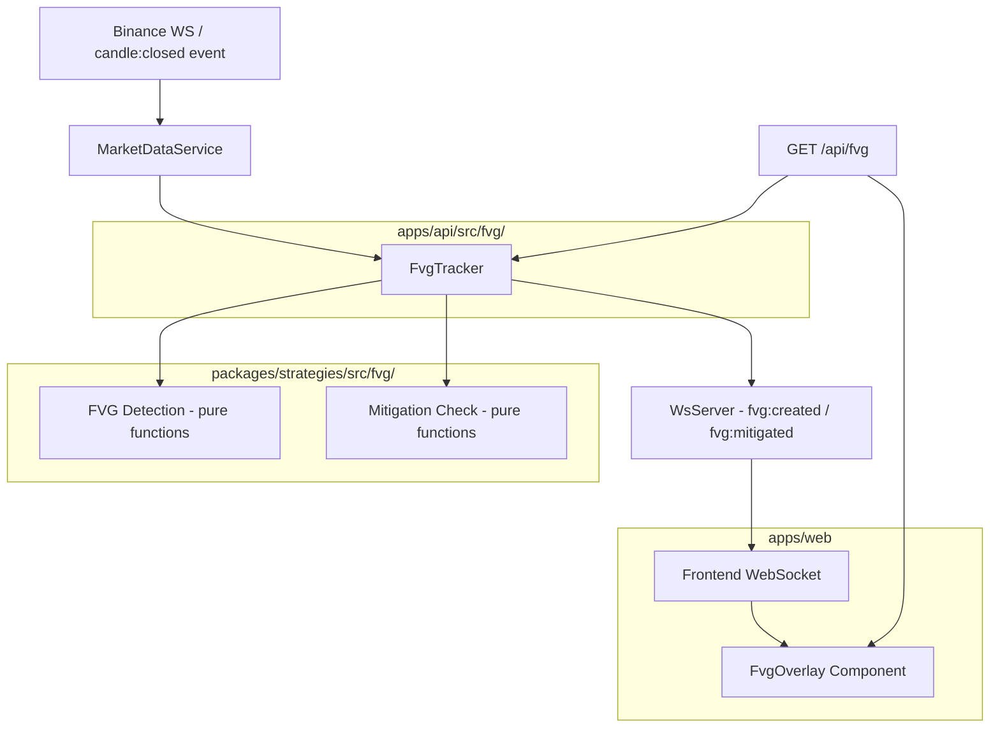

# Design Document: Phase 3 — FVG Module

## Overview

This design implements the Fair Value Gap (FVG) detection and visualization module for the ICT Forward Lab. The module spans the full stack: pure detection functions in `packages/strategies`, a stateful tracker in `apps/api`, real-time WebSocket event broadcasting, a REST API for initial state, and chart rendering via Lightweight Charts v5 custom primitives.

The architecture prioritizes testability by keeping detection logic as pure functions, separating state management into a dedicated tracker class, and isolating rendering into a chart overlay component.

## Architecture



### Data Flow

1. `MarketDataService` receives a `candle:closed` event from Binance WS
2. It calls `FvgTracker.onCandleClosed(candle, symbol, timeframe)`
3. `FvgTracker` invokes the pure `isBullishFvg`/`isBearishFvg` detection functions
4. If new FVGs are found, they're added to the in-memory collection and broadcast via `fvg:created`
5. `FvgTracker` checks all active zones against the new candle for mitigation
6. Mitigated zones are updated and broadcast via `fvg:mitigated`
7. Frontend receives events and updates the `FvgOverlay` rendering

### Design Decisions

- **Pure functions for detection**: `isBullishFvg`, `isBearishFvg`, `createBullishFvgZone`, `createBearishFvgZone`, `checkMitigation`, `detectAllFvgs` are all pure functions with no side effects. This makes them trivially testable with property-based testing.
- **In-memory state in FvgTracker**: FVG zones are stored in memory per symbol/timeframe pair. This avoids database complexity for Phase 3 while allowing the tracker to rebuild state from historical candles on startup.
- **No database persistence for zones**: Since zones can be reconstructed from candle history, we avoid adding DB tables. The REST endpoint queries the tracker's in-memory state.
- **Shared FvgZone type in packages/core**: Both API and web need the type, so it lives in the shared core package.

## Components and Interfaces

### 1. FVG Detection Functions (`packages/strategies/src/fvg/`)

```typescript
// packages/strategies/src/fvg/detect.ts

import type { Candle } from "@ict-forward-lab/core";
import type { FvgZone } from "@ict-forward-lab/core";

export function isBullishFvg(candles: Candle[], i: number): boolean;
export function isBearishFvg(candles: Candle[], i: number): boolean;
export function createBullishFvgZone(candles: Candle[], i: number): FvgZone | null;
export function createBearishFvgZone(candles: Candle[], i: number): FvgZone | null;
export function detectAllFvgs(candles: Candle[]): FvgZone[];
```

```typescript
// packages/strategies/src/fvg/mitigation.ts

import type { Candle } from "@ict-forward-lab/core";
import type { FvgZone } from "@ict-forward-lab/core";

export function checkMitigation(zone: FvgZone, candle: Candle): boolean;
```

### 2. FVG Tracker (`apps/api/src/fvg/fvg-tracker.ts`)

```typescript
export interface FvgTrackerOptions {
  wsServer: WsServer;
}

export class FvgTracker {
  // Map key: `${symbol}:${timeframe}`
  private zones: Map<string, FvgZone[]>;

  constructor(options: FvgTrackerOptions);

  /** Process a closed candle — detect new FVGs and check mitigation */
  onCandleClosed(candle: Candle, symbol: string, timeframe: string): void;

  /** Build initial state from historical candles */
  loadHistory(candles: Candle[], symbol: string, timeframe: string): void;

  /** Get all zones for a symbol/timeframe pair */
  getZones(symbol: string, timeframe: string): FvgZone[];

  /** Get only active zones */
  getActiveZones(symbol: string, timeframe: string): FvgZone[];
}
```

### 3. FVG REST Route (`apps/api/src/routes/fvg.ts`)

```typescript
// GET /api/fvg?symbol=BTCUSDT&timeframe=5m
// Response: FvgZone[]
// 400 if symbol or timeframe missing
```

### 4. Extended WsServer Events

```typescript
// Additional event types added to WsBroadcastMessage
export type WsFvgEventType = "fvg:created" | "fvg:mitigated";

export interface WsFvgCreatedMessage {
  event: "fvg:created";
  data: {
    symbol: string;
    timeframe: string;
    zone: FvgZone;
  };
}

export interface WsFvgMitigatedMessage {
  event: "fvg:mitigated";
  data: {
    symbol: string;
    timeframe: string;
    zoneId: string;
    status: "mitigated";
  };
}
```

### 5. FvgOverlay Component (`apps/web/components/chart/FvgOverlay.tsx`)

```typescript
interface FvgOverlayProps {
  chart: IChartApi;
  series: ISeriesApi<"Candlestick">;
  symbol: string;
  timeframe: string;
}
```

The overlay:
- Fetches initial FVG zones from `GET /api/fvg`
- Subscribes to `fvg:created` and `fvg:mitigated` WebSocket events
- Renders boxes using Lightweight Charts v5 `createBox` primitive or `ISeriesPrimitive` plugin API
- Updates box styling on mitigation without full re-render

## Data Models

### FvgZone (shared type in `packages/core/src/types/fvg.ts`)

```typescript
export interface FvgZone {
  id: string;                          // "{direction}-fvg-{time}"
  direction: "bullish" | "bearish";
  fromTime: number;                    // Unix seconds — candle[i-2].time
  toTime: number;                      // Unix seconds — candle[i].time
  top: number;                         // Upper boundary of the gap
  bottom: number;                      // Lower boundary of the gap
  status: "active" | "mitigated";
}
```

**Invariants:**
- `top > bottom` always (otherwise no gap exists)
- `fromTime < toTime` always
- `status` transitions only from `"active"` → `"mitigated"`, never back

### FVG WebSocket Message Types (added to `packages/core/src/types/ws-messages.ts`)

```typescript
export type WsFvgEventType = "fvg:created" | "fvg:mitigated";

export interface WsFvgCreatedMessage {
  event: "fvg:created";
  data: {
    symbol: string;
    timeframe: string;
    zone: FvgZone;
  };
}

export interface WsFvgMitigatedMessage {
  event: "fvg:mitigated";
  data: {
    symbol: string;
    timeframe: string;
    zoneId: string;
    status: "mitigated";
  };
}

export type WsFvgMessage = WsFvgCreatedMessage | WsFvgMitigatedMessage;
```

## Correctness Properties

*A property is a characteristic or behavior that should hold true across all valid executions of a system — essentially, a formal statement about what the system should do. Properties serve as the bridge between human-readable specifications and machine-verifiable correctness guarantees.*

### Property 1: Bullish FVG Detection Correctness

*For any* array of candles and valid index `i >= 2`, `isBullishFvg(candles, i)` returns `true` if and only if `candles[i].low > candles[i-2].high`.

**Validates: Requirements 1.1, 1.4**

### Property 2: Bullish FVG Zone Boundaries

*For any* array of candles forming a valid bullish FVG at index `i`, `createBullishFvgZone(candles, i)` SHALL return a zone where `top === candles[i].low` and `bottom === candles[i-2].high`.

**Validates: Requirements 1.2**

### Property 3: Bearish FVG Detection Correctness

*For any* array of candles and valid index `i >= 2`, `isBearishFvg(candles, i)` returns `true` if and only if `candles[i].high < candles[i-2].low`.

**Validates: Requirements 2.1, 2.4**

### Property 4: Bearish FVG Zone Boundaries

*For any* array of candles forming a valid bearish FVG at index `i`, `createBearishFvgZone(candles, i)` SHALL return a zone where `top === candles[i-2].low` and `bottom === candles[i].high`.

**Validates: Requirements 2.2**

### Property 5: Mitigation Correctness

*For any* FVG zone and candle, `checkMitigation(zone, candle)` returns `true` if and only if: for a bullish zone, `candle.close <= zone.top`; for a bearish zone, `candle.close >= zone.bottom`.

**Validates: Requirements 3.2, 3.3**

### Property 6: Sequential Processing Builds Complete State

*For any* array of candles, processing them sequentially through `detectAllFvgs` and applying mitigation checks produces the same set of zones (with correct statuses) as the `FvgTracker.loadHistory()` method.

**Validates: Requirements 3.1, 3.6**

### Property 7: Zone Preservation Invariant

*For any* sequence of candle-close operations processed by `FvgTracker`, the total number of zones in the collection never decreases. Mitigated zones remain in the collection.

**Validates: Requirements 3.5**

### Property 8: Closed-Candle-Only Invariant

*For any* candle where `isClosed === false`, passing it to the detection functions SHALL never produce a detected FVG. The tracker's zone collection remains unchanged after processing unclosed candles.

**Validates: Requirements 4.1, 4.2**

### Property 9: FVG Event Message Format

*For any* FVG zone, the serialized WebSocket event message SHALL contain `event`, `data.symbol`, `data.timeframe`, and either `data.zone` (for created) or `data.zoneId` (for mitigated) fields.

**Validates: Requirements 5.1, 5.2, 5.3**

## Error Handling

| Scenario | Handling |
|----------|----------|
| Candle array has fewer than 3 elements | Detection functions return `null`/empty array — no error thrown |
| Index out of bounds (`i < 2`) | Detection functions return `false`/`null` with early return |
| Invalid candle data (NaN prices) | Detection returns `false` since numeric comparisons with NaN are always false |
| WebSocket broadcast failure | Log error, continue processing — non-critical path |
| REST endpoint missing params | Return 400 with descriptive error message |
| FvgTracker not initialized (no history) | Return empty array from `getZones()` |
| Symbol/timeframe not tracked | Return empty array — no error |

## Testing Strategy

### Property-Based Tests (fast-check, minimum 100 iterations)

The core detection and mitigation functions are pure and ideal for property-based testing:

- **Library**: `fast-check` (already available in the project)
- **Location**: `packages/strategies/src/fvg/__tests__/` for detection logic
- **Configuration**: Minimum 100 iterations per property
- **Tag format**: `Feature: phase3-fvg-module, Property {N}: {description}`

Properties 1–5 directly test pure functions and are the highest-value PBT targets. Properties 6–8 test stateful behavior of the tracker and require slightly more complex generators (sequences of candles).

### Unit Tests (vitest)

- FvgTracker event emission (fvg:created, fvg:mitigated events are fired correctly)
- REST route returns 400 for missing params
- REST route returns correct FvgZone[] structure
- FvgOverlay creates correct chart primitives for bullish/bearish zones
- FvgOverlay updates styling on mitigation

### Integration Tests

- End-to-end: candle:closed event → FvgTracker detection → WebSocket broadcast → client receives event
- REST endpoint returns zones matching tracker state
- Chart renders FVG boxes on initial load from REST data

### Generators for Property Tests

```typescript
// Candle generator
const arbCandle = fc.record({
  time: fc.integer({ min: 1600000000, max: 1800000000 }),
  open: fc.float({ min: 10000, max: 100000, noNaN: true }),
  high: fc.float({ min: 10000, max: 100000, noNaN: true }),
  low: fc.float({ min: 10000, max: 100000, noNaN: true }),
  close: fc.float({ min: 10000, max: 100000, noNaN: true }),
  volume: fc.float({ min: 0, max: 1000000, noNaN: true }),
  isClosed: fc.constant(true),
});

// Bullish FVG triplet generator (guaranteed to form a bullish FVG)
const arbBullishFvgTriplet = fc.tuple(arbCandle, arbCandle, arbCandle)
  .map(([c0, c1, c2]) => {
    // Ensure c2.low > c0.high
    const gap = Math.abs(c2.low - c0.high) + 1;
    return [c0, c1, { ...c2, low: c0.high + gap }];
  });
```
