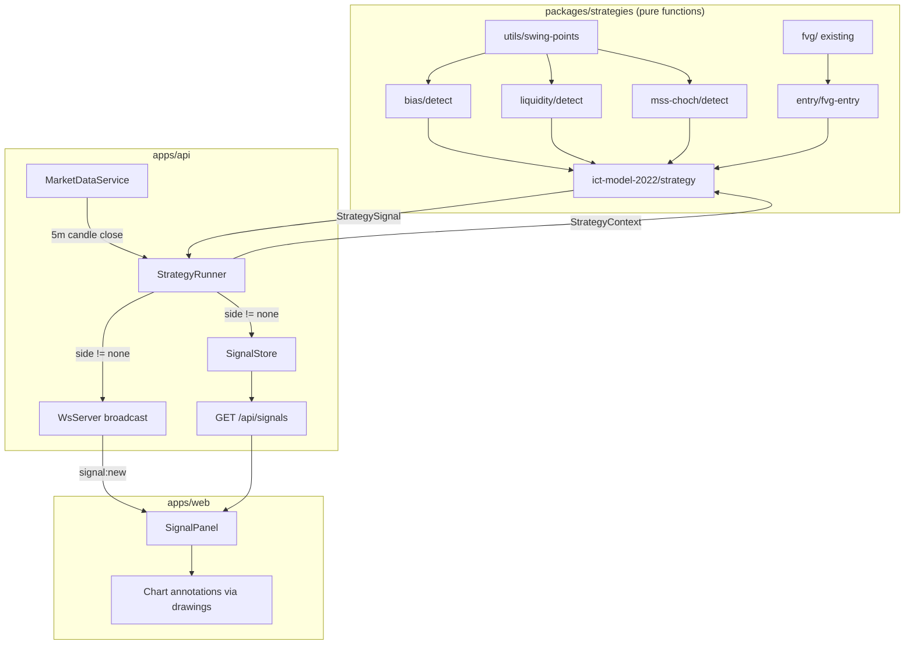

# Design Document: Phase 4 — ICT / A-Model Strategy

## Overview

Phase 4 adds the multi-timeframe ICT strategy engine to the ICT Forward Lab. The strategy follows the ICT A-Model approach: determine 4H directional bias → detect 15m liquidity sweep → confirm 15m MSS/ChoCh → find 5m FVG entry. Each step is implemented as a pure function module in `packages/strategies`, and an orchestrator combines them to produce structured `StrategySignal` outputs.

The API layer receives a `StrategyRunner` that triggers evaluation on each closed 5m candle, stores actionable signals, and broadcasts them via WebSocket. The frontend renders signals in a panel and annotates the chart with drawings from the signal payload.

## Architecture



### Data Flow

1. `MarketDataService` detects a closed 5m candle.
2. `StrategyRunner.onCandleClosed()` builds a `StrategyContext` from in-memory + DB candles for all four timeframes (5m, 15m, 1h, 4h).
3. The pure `ictModel2022Strategy(ctx)` function is called.
4. Inside the strategy: swing points → bias → liquidity → MSS → entry → signal.
5. If signal.side ≠ "none": persist to store, broadcast via WS.
6. Frontend receives the signal and renders panel + chart annotations.

### Key Design Decisions

- **Pure functions for all strategy logic**: No side effects in `packages/strategies`. This enables deterministic testing, replay, and prevents repainting.
- **Shared swing point utility**: All modules use the same pivot detection algorithm, ensuring consistency.
- **In-memory signal store**: V1 uses a bounded in-memory array for signals. DB persistence is a future enhancement (the signals table schema exists).
- **Strategy evaluates only closed candles**: The `StrategyRunner` gates on `isClosed === true` before invoking the strategy.

## Components and Interfaces

### 1. Swing Point Detector (`packages/strategies/src/utils/swing-points.ts`)

```typescript
import type { Candle } from "@ict-forward-lab/core";
import type { SwingPoint } from "../ict-model-2022/types";

export function detectSwingPoints(
  candles: Candle[],
  leftBars?: number,  // default 5
  rightBars?: number  // default 5
): SwingPoint[];
```

Identifies local highs/lows by checking that the candle's high (or low) is the most extreme value among `leftBars` candles to the left and `rightBars` candles to the right.

### 2. Bias Module (`packages/strategies/src/bias/detect.ts`)

```typescript
import type { Candle } from "@ict-forward-lab/core";
import type { BiasDirection } from "../ict-model-2022/types";

export function detect4HBias(candles4h: Candle[]): BiasDirection;
```

Analyzes the last 20 4H candles, detects swing points, and classifies the structure:
- HH + HL → "bullish"
- LH + LL → "bearish"
- Otherwise → "neutral"

### 3. Liquidity Sweep Detector (`packages/strategies/src/liquidity/detect.ts`)

```typescript
import type { Candle } from "@ict-forward-lab/core";
import type { LiquiditySweepResult } from "../ict-model-2022/types";

export function detectLiquiditySweep(candles15m: Candle[]): LiquiditySweepResult | null;
```

Checks the most recent candle against all swing points in the lookback window:
- Low wick below swing low + close above → sell-side sweep
- High wick above swing high + close below → buy-side sweep

### 4. MSS/ChoCh Detector (`packages/strategies/src/mss-choch/detect.ts`)

```typescript
import type { Candle } from "@ict-forward-lab/core";
import type { MSSResult } from "../ict-model-2022/types";

export function detectMSS(candles15m: Candle[]): MSSResult | null;
```

Determines existing trend structure from swing points, then identifies breaks:
- Downtrend + break above last lower high → bullish MSS
- Uptrend + break below last higher low → bearish MSS

### 5. FVG Entry Detector (`packages/strategies/src/entry/fvg-entry.ts`)

```typescript
import type { Candle, FvgZone } from "@ict-forward-lab/core";
import type { FvgEntryResult, LiquiditySweepResult } from "../ict-model-2022/types";

export function detectFvgEntry(
  candles5m: Candle[],
  direction: "bullish" | "bearish",
  sweepResult: LiquiditySweepResult
): FvgEntryResult | null;
```

Finds the most recent FVG on 5m matching the direction, then calculates entry/SL/TP:
- Bullish: entry at FVG top edge, SL below swept swing low, TP at 2:1 RR
- Bearish: entry at FVG bottom edge, SL above swept swing high, TP at 2:1 RR

### 6. Strategy Orchestrator (`packages/strategies/src/ict-model-2022/strategy.ts`)

```typescript
import type { StrategyContext, StrategySignal } from "./types";

export function ictModel2022Strategy(ctx: StrategyContext): StrategySignal;
```

Combines all modules in sequence. Returns a signal with side "long", "short", or "none".

### 7. Strategy Runner (`apps/api/src/strategy/strategy-runner.ts`)

```typescript
export class StrategyRunner {
  constructor(options: { pool: Pool; wsServer: WsServer; symbol: string });
  onCandleClosed(candle: Candle, symbol: string, timeframe: string): Promise<void>;
  getRecentSignals(limit?: number): StrategySignal[];
}
```

Triggers strategy evaluation on 5m close, manages context building from DB, stores and broadcasts signals.

### 8. Signal Store (`apps/api/src/strategy/signal-store.ts`)

```typescript
export class SignalStore {
  add(signal: StrategySignal): void;
  getRecent(limit?: number): StrategySignal[];
  getBySymbol(symbol: string, limit?: number): StrategySignal[];
}
```

Bounded in-memory ring buffer (max 100 signals). Provides recent signal retrieval for the REST endpoint.

### 9. Signals REST Route (`apps/api/src/routes/signals.ts`)

```
GET /api/signals?symbol=BTCUSDT&limit=20
```

Returns recent signals from the SignalStore.

## Data Models

### Core Types (`packages/strategies/src/ict-model-2022/types.ts`)

```typescript
export interface SwingPoint {
  type: "high" | "low";
  price: number;
  time: number;
  index: number;
}

export type BiasDirection = "bullish" | "bearish" | "neutral";

export interface LiquiditySweepResult {
  type: "sell-side" | "buy-side";
  sweptLevel: number;
  sweepCandle: Candle;
  time: number;
}

export interface MSSResult {
  direction: "bullish" | "bearish";
  breakLevel: number;
  breakCandle: Candle;
  time: number;
}

export interface FvgEntryResult {
  direction: "bullish" | "bearish";
  entry: number;
  stopLoss: number;
  takeProfit: number;
  riskReward: number;
  fvgZone: FvgZone;
  time: number;
}

export interface StrategyContext {
  symbol: string;
  exchange: "binance" | "bybit";
  candles5m: Candle[];
  candles15m: Candle[];
  candles1h: Candle[];
  candles4h: Candle[];
}

export type SignalSide = "long" | "short" | "none";

export interface ChartDrawing {
  id: string;
  type: "box" | "line" | "marker" | "label";
  label?: string;
  fromTime?: number;
  toTime?: number;
  price?: number;
  top?: number;
  bottom?: number;
  direction?: "bullish" | "bearish";
  metadata?: Record<string, unknown>;
}

export interface StrategySignal {
  side: SignalSide;
  symbol: string;
  timeframe: string;
  signalTime: number;
  entry?: number;
  stopLoss?: number;
  takeProfit?: number;
  riskReward?: number;
  reasons: string[];
  drawings: ChartDrawing[];
  metadata?: Record<string, unknown>;
}
```

### WebSocket Signal Message

```typescript
// Extension to existing WsServer broadcast types
export interface WsSignalMessage {
  event: "signal:new";
  data: StrategySignal;
}
```


## Correctness Properties

*A property is a characteristic or behavior that should hold true across all valid executions of a system — essentially, a formal statement about what the system should do. Properties serve as the bridge between human-readable specifications and machine-verifiable correctness guarantees.*

### Property 1: Swing Point Correctness

*For any* candle array and valid left/right bar counts, every SwingPoint returned by `detectSwingPoints` must satisfy: if type is "high", the candle at that index has a high strictly greater than the high of all candles within leftBars to the left and rightBars to the right; if type is "low", the candle at that index has a low strictly less than the low of all candles within the same window. Additionally, price must equal the candle's high or low (matching type), time must equal the candle's time, and index must equal the candle's position in the array.

**Validates: Requirements 1.1, 1.2, 1.3**

### Property 2: Bias Classification Correctness

*For any* 4H candle array where swing points can be detected, if the last two swing highs form a Higher High and the last two swing lows form a Higher Low, `detect4HBias` shall return "bullish"; if they form Lower High and Lower Low, it shall return "bearish"; in all other cases (including fewer than 4 swing points), it shall return "neutral".

**Validates: Requirements 2.1, 2.2, 2.3, 2.5**

### Property 3: Liquidity Sweep Detection Correctness

*For any* 15m candle array where the most recent candle's low wick extends below a detected swing low but its close remains above that swing low, `detectLiquiditySweep` shall return a sell-side result with sweptLevel equal to that swing low price. Symmetrically, if the high wick extends above a swing high but close stays below, it shall return a buy-side result. The sweepCandle field must reference the triggering candle.

**Validates: Requirements 3.1, 3.2, 3.3**

### Property 4: MSS Detection Correctness

*For any* 15m candle array with at least 3 swing points forming a downtrend (LH/LL pattern), if the most recent candle's close breaks above the last lower high, `detectMSS` shall return a bullish MSS with breakLevel equal to that lower high. Symmetrically, for an uptrend (HH/HL) with a break below the last higher low, it shall return bearish. The breakCandle must reference the triggering candle.

**Validates: Requirements 4.1, 4.2, 4.3, 4.6**

### Property 5: FVG Entry Placement Correctness

*For any* 5m candle array containing a valid FVG in the specified direction, `detectFvgEntry` shall return an entry price equal to the FVG zone's top edge for bullish direction, and the FVG zone's bottom edge for bearish direction. The returned fvgZone must match the detected FVG.

**Validates: Requirements 5.1, 5.2, 5.6**

### Property 6: Risk-Reward Calculation

*For any* FvgEntryResult produced by `detectFvgEntry`, the relationship |takeProfit - entry| / |entry - stopLoss| shall equal 2.0 (within floating-point tolerance of 1e-9). For bullish entries, stopLoss < entry < takeProfit. For bearish entries, takeProfit < entry < stopLoss.

**Validates: Requirements 5.3, 5.4**

### Property 7: Strategy Confluence Determines Signal Side

*For any* StrategyContext, `ictModel2022Strategy` shall return side "long" if and only if: bias is bullish AND sell-side sweep detected AND bullish MSS confirmed AND bullish FVG entry found. It shall return "short" if and only if: bias is bearish AND buy-side sweep AND bearish MSS AND bearish FVG entry. In all other cases, side shall be "none".

**Validates: Requirements 6.1, 6.2, 6.3**

### Property 8: Signal Structure Invariant

*For any* StrategySignal produced by the strategy, if side is "long" or "short" then entry, stopLoss, takeProfit, and riskReward must be defined numbers, reasons must be a non-empty array, and drawings must be a non-empty array. If side is "none", then reasons and drawings must be empty arrays.

**Validates: Requirements 6.4, 6.5, 7.2, 7.3, 7.4**

### Property 9: No-Repaint Signal Timing

*For any* StrategySignal produced by the strategy with side ≠ "none", the signalTime must correspond to the time of the last closed candle in the 5m array. The strategy shall not use any candle where isClosed is false for signal generation.

**Validates: Requirements 9.1, 9.3**

## Error Handling

| Scenario | Handling |
|----------|----------|
| Insufficient candle data for swing detection | Return empty array (no crash) |
| No bias determinable (< 4 swing points) | Return "neutral" — strategy produces "none" signal |
| No liquidity sweep detected | Return null → strategy short-circuits to "none" |
| No MSS detected | Return null → strategy short-circuits to "none" |
| No qualifying FVG on 5m | Return null → strategy short-circuits to "none" |
| StrategyContext with empty candle arrays | Each module handles gracefully, returns null/neutral |
| StrategyRunner receives unclosed candle | Skip evaluation entirely |
| WebSocket broadcast failure | Log error, do not crash the runner |
| Signal store overflow (> 100) | Ring buffer evicts oldest signals |
| DB query failure during context building | Log error, skip this evaluation cycle |

All strategy module functions are designed to fail gracefully by returning null or neutral values. The orchestrator short-circuits at the first missing factor, producing a "none" signal. No exceptions should propagate from strategy logic.

## Testing Strategy

### Property-Based Tests (using `fast-check`)

Each correctness property above is implemented as a property-based test with minimum 100 iterations. The test library `fast-check` is already a devDependency of `@ict-forward-lab/strategies`.

- **Swing point tests**: Generate random candle arrays, plant known swing points, verify detection. Also test with random arrays and verify all returned points satisfy the definition.
- **Bias tests**: Generate 4H candle arrays with controlled swing structures (HH/HL, LH/LL, mixed), verify classification.
- **Liquidity sweep tests**: Generate 15m arrays with known sweep candles, verify detection correctness.
- **MSS tests**: Generate 15m arrays with known trend + break candles, verify detection.
- **FVG entry tests**: Generate 5m arrays with known FVGs, verify entry/SL/TP calculations.
- **Risk-reward tests**: For any entry result, verify the 2:1 ratio holds mathematically.
- **Orchestration tests**: Generate full StrategyContexts with controlled module outputs, verify signal correctness.
- **Signal structure tests**: For any signal produced, verify the structural invariant.
- **No-repaint tests**: Verify signalTime integrity and closed-candle gating.

Configuration:
- Minimum 100 iterations per property test
- Each test tagged: `Feature: phase4-ict-strategy, Property {N}: {title}`

### Unit Tests (example-based)

- Default parameter values (5-bar lookback)
- Specific known market patterns (e.g., textbook MSS from ICT examples)
- Edge cases: empty arrays, single candle, exactly N candles

### Integration Tests

- StrategyRunner invocation on candle close
- WebSocket broadcast of signals
- REST endpoint response format
- Signal persistence to in-memory store
- Unclosed candle rejection

### Test File Layout

```
packages/strategies/src/
  utils/swing-points.test.ts
  bias/detect.test.ts
  liquidity/detect.test.ts
  mss-choch/detect.test.ts
  entry/fvg-entry.test.ts
  ict-model-2022/strategy.test.ts
```
