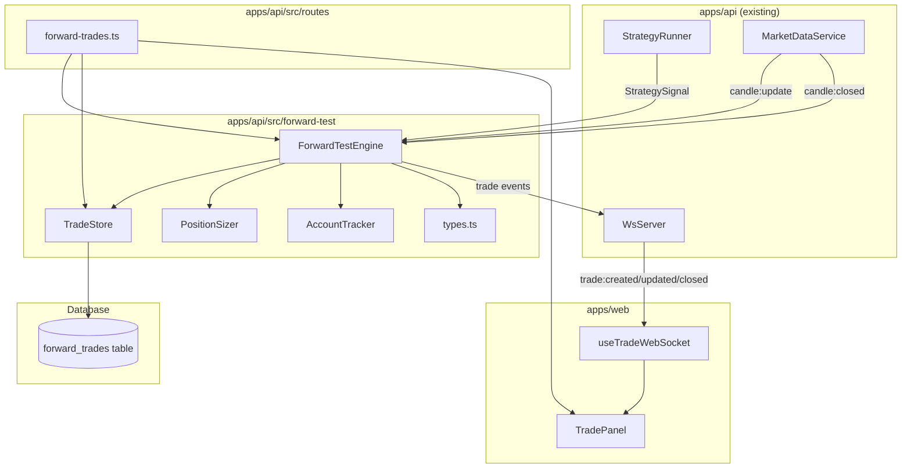

# Design Document: Phase 5 — Forward-Test Engine

## Overview

Phase 5 adds a virtual trade execution engine to the ICT Forward Lab. When the Strategy Runner (Phase 4) produces a signal with side "long" or "short", the Forward-Test Engine creates a virtual trade, monitors candle ticks for entry triggers, tracks SL/TP hits and timeouts, calculates PnL with fees and slippage, and persists results to PostgreSQL. A virtual account tracker maintains running balance for accurate position sizing.

The engine operates reactively: `onSignal()` creates pending trades, `onTick()` checks entry/exit on every candle update, and `onCandleClosed()` checks timeout expiration. All trade lifecycle events are broadcast via WebSocket so the frontend can display real-time trade status.

## Architecture



### Data Flow

1. `StrategyRunner.onCandleClosed()` produces a `StrategySignal` with side ≠ "none".
2. `ForwardTestEngine.onSignal(signal)` validates limits, calculates position size, creates a pending trade, persists it, and broadcasts `trade:created`.
3. `MarketDataService` emits `candle:update` → `ForwardTestEngine.onTick(candle)`:
   - For pending trades: checks if entry price is reached → transitions to active.
   - For active trades: checks SL/TP hit → closes trade.
4. `MarketDataService` emits `candle:closed` → `ForwardTestEngine.onCandleClosed(candle)`:
   - Increments candle counters for timeout tracking.
   - Expires pending trades or closes active trades that exceed `tradeTimeoutCandles`.
5. On trade close: PnL is calculated, account balance is updated, trade is persisted, and `trade:closed` is broadcast.

### Key Design Decisions

- **Worst-case assumption on same-candle SL+TP**: If both SL and TP are triggered on the same candle, SL is assumed to have hit first. This is conservative and avoids overstating performance.
- **Slippage applied at both entry and exit**: Entry slippage worsens the fill (higher for longs, lower for shorts). Exit slippage on SL/TP also models realistic fills.
- **Fees on both legs**: Entry and exit notional values are each charged the fee percentage.
- **In-memory account tracker + DB trades**: Account balance is reconstructed from DB on startup, then maintained in-memory for fast access.
- **Pure position sizer function**: Position sizing is a pure calculation with no side effects — easily testable.
- **Candle counter for timeout**: A simple counter tracks closed candles since entry/creation, avoiding timezone complexity.

## Components and Interfaces

### 1. Types (`apps/api/src/forward-test/types.ts`)

```typescript
export type TradeStatus =
  | "pending"
  | "active"
  | "closed_win"
  | "closed_loss"
  | "closed_breakeven"
  | "closed_manual"
  | "cancelled"
  | "expired";

export interface ForwardTestConfig {
  initialBalance: number;
  riskPerTradePercent: number;
  feePercent: number;
  slippagePercent: number;
  maxOpenTrades: number;
  maxTradesPerDay: number;
  minRiskReward: number;
  tradeTimeoutCandles: number;
}

export interface ForwardTrade {
  id: string;
  signalId: string;
  strategyName: string;
  strategyVersion: string;
  exchange: string;
  symbol: string;
  side: "long" | "short";
  status: TradeStatus;
  entryTime?: number;
  entryPrice?: number;
  stopLoss: number;
  takeProfit: number;
  exitTime?: number;
  exitPrice?: number;
  exitReason?: "tp" | "sl" | "timeout" | "manual" | "cancelled";
  riskAmount: number;
  positionSize: number;
  pnl?: number;
  pnlPercent?: number;
  rrResult?: number;
  notes?: string;
  metadata?: Record<string, unknown>;
  createdAt: number;
  updatedAt: number;
}
```

### 2. Position Sizer (`apps/api/src/forward-test/position-sizer.ts`)

```typescript
export interface PositionSizeParams {
  accountBalance: number;
  riskPercent: number;
  entry: number;
  stopLoss: number;
}

export interface PositionSizeResult {
  positionSize: number;
  riskAmount: number;
}

export function calculatePositionSize(params: PositionSizeParams): PositionSizeResult;
```

Pure function. Returns `{ positionSize, riskAmount }`. Throws or returns zero if entry === stopLoss.

### 3. Account Tracker (`apps/api/src/forward-test/account-tracker.ts`)

```typescript
export class AccountTracker {
  constructor(initialBalance: number);
  getBalance(): number;
  applyPnl(pnl: number): void;
  isAccountDepleted(): boolean;
  reset(balance: number): void;
}
```

Maintains the running virtual balance. Initializes from config or reconstructs from DB on startup.

### 4. Trade Store (`apps/api/src/forward-test/trade-store.ts`)

```typescript
export class TradeStore {
  constructor(pool: Pool);
  create(trade: ForwardTrade): Promise<ForwardTrade>;
  update(trade: ForwardTrade): Promise<ForwardTrade>;
  getById(id: string): Promise<ForwardTrade | null>;
  getAll(filters?: TradeFilters): Promise<ForwardTrade[]>;
  getOpenTrades(): Promise<ForwardTrade[]>;
  getTodayTradeCount(): Promise<number>;
}
```

PostgreSQL CRUD using parameterized queries. Maps between camelCase TypeScript fields and snake_case DB columns.

### 5. Forward-Test Engine (`apps/api/src/forward-test/forward-test-engine.ts`)

```typescript
export class ForwardTestEngine {
  constructor(options: {
    config: ForwardTestConfig;
    tradeStore: TradeStore;
    accountTracker: AccountTracker;
    wsServer: WsServer;
  });

  async onSignal(signal: StrategySignal): Promise<ForwardTrade | null>;
  async onTick(candle: Candle): Promise<void>;
  async onCandleClosed(candle: Candle): Promise<void>;
  async manualClose(tradeId: string, currentPrice: number): Promise<ForwardTrade>;
  async cancelTrade(tradeId: string): Promise<ForwardTrade>;
  async initialize(): Promise<void>;
}
```

The main orchestrator. Manages the trade lifecycle, validates limits, and coordinates between components.

### 6. REST Routes (`apps/api/src/routes/forward-trades.ts`)

```
GET  /api/forward-trades?status=active&symbol=BTCUSDT&side=long
GET  /api/forward-trades/:id
POST /api/forward-trades/:id/manual-close
POST /api/forward-trades/:id/cancel
```

### 7. WebSocket Events (extension to existing WsServer)

```typescript
// New broadcast method on WsServer
broadcastTrade(event: "trade:created" | "trade:updated" | "trade:closed", trade: ForwardTrade): void;
```

### 8. Frontend Hook (`apps/web/hooks/useTradeWebSocket.ts`)

```typescript
export function useTradeWebSocket(): {
  activeTrades: ForwardTrade[];
  recentTrades: ForwardTrade[];
};
```

Subscribes to trade:created, trade:updated, trade:closed events and maintains state.

### 9. Frontend Panel (`apps/web/components/chart/TradePanel.tsx`)

Renders active trades (symbol, side, entry, unrealized PnL, SL, TP, duration) and recent closed trades (exit reason, PnL, RR, duration). Provides Close and Cancel buttons.

## Data Models

### Database Schema: `forward_trades`

```sql
CREATE TABLE IF NOT EXISTS forward_trades (
  id BIGSERIAL PRIMARY KEY,
  signal_id TEXT NOT NULL,
  strategy_name TEXT NOT NULL DEFAULT 'ict-model-2022',
  strategy_version TEXT DEFAULT '1.0.0',
  exchange TEXT NOT NULL DEFAULT 'binance',
  symbol TEXT NOT NULL,
  side TEXT NOT NULL,
  status TEXT NOT NULL,
  entry_time TIMESTAMPTZ,
  entry_price NUMERIC,
  stop_loss NUMERIC NOT NULL,
  take_profit NUMERIC NOT NULL,
  exit_time TIMESTAMPTZ,
  exit_price NUMERIC,
  exit_reason TEXT,
  risk_amount NUMERIC,
  position_size NUMERIC,
  pnl NUMERIC,
  pnl_percent NUMERIC,
  rr_result NUMERIC,
  notes TEXT,
  metadata JSONB,
  created_at TIMESTAMPTZ DEFAULT now(),
  updated_at TIMESTAMPTZ DEFAULT now()
);

CREATE INDEX idx_forward_trades_status ON forward_trades(status);
CREATE INDEX idx_forward_trades_symbol ON forward_trades(symbol);
CREATE INDEX idx_forward_trades_created_at ON forward_trades(created_at);
```

### ForwardTestConfig Defaults

```typescript
export const defaultForwardTestConfig: ForwardTestConfig = {
  initialBalance: 10_000,
  riskPerTradePercent: 1,
  feePercent: 0.04,
  slippagePercent: 0.02,
  maxOpenTrades: 1,
  maxTradesPerDay: 3,
  minRiskReward: 2,
  tradeTimeoutCandles: 24,
};
```

### PnL Calculation Formulas

```
For LONG trades:
  rawPnl = (exitPrice - entryPrice) * positionSize
  entryFee = entryPrice * positionSize * feePercent / 100
  exitFee = exitPrice * positionSize * feePercent / 100
  netPnl = rawPnl - entryFee - exitFee
  pnlPercent = (netPnl / accountBalanceAtEntry) * 100
  rrResult = netPnl / riskAmount

For SHORT trades:
  rawPnl = (entryPrice - exitPrice) * positionSize
  (fees same as above)

Slippage on entry:
  long:  entryPrice = signal.entry * (1 + slippagePercent / 100)
  short: entryPrice = signal.entry * (1 - slippagePercent / 100)

Slippage on SL exit:
  long:  exitPrice = stopLoss * (1 - slippagePercent / 100)   [worse for longs]
  short: exitPrice = stopLoss * (1 + slippagePercent / 100)   [worse for shorts]

Slippage on TP exit:
  long:  exitPrice = takeProfit * (1 - slippagePercent / 100) [slightly worse]
  short: exitPrice = takeProfit * (1 + slippagePercent / 100) [slightly worse]
```


## Correctness Properties

*A property is a characteristic or behavior that should hold true across all valid executions of a system — essentially, a formal statement about what the system should do. Properties serve as the bridge between human-readable specifications and machine-verifiable correctness guarantees.*

### Property 1: Position Size Calculation

*For any* valid account balance > 0, risk percent > 0, entry price, and stop-loss price where entry ≠ stopLoss, the calculated positionSize SHALL equal `(accountBalance * riskPercent / 100) / |entry - stopLoss|`, and riskAmount SHALL equal `accountBalance * riskPercent / 100`. If entry equals stopLoss, the function SHALL reject with zero or error.

**Validates: Requirements 1.2, 1.3**

### Property 2: Entry Trigger Correctness

*For any* pending trade and candle tick: a long trade SHALL transition to "active" if and only if the candle's high is at or above the trade's entry price; a short trade SHALL transition to "active" if and only if the candle's low is at or below the trade's entry price. The entryTime SHALL be set to the candle's time. Trades not meeting the condition SHALL remain "pending".

**Validates: Requirements 2.1, 2.2**

### Property 3: Slippage Application

*For any* trade activation with slippage percent S and signal entry E: for long trades, the effective entry price SHALL equal `E * (1 + S/100)` (worse fill for buyer); for short trades, it SHALL equal `E * (1 - S/100)` (worse fill for seller). For SL exits: longs get `stopLoss * (1 - S/100)`, shorts get `stopLoss * (1 + S/100)`. For TP exits: longs get `takeProfit * (1 - S/100)`, shorts get `takeProfit * (1 + S/100)`.

**Validates: Requirements 2.3, 3.1, 3.2, 3.3, 3.4**

### Property 4: SL/TP Exit Correctness

*For any* active trade and candle tick: a long trade SHALL close with "sl" if candle low ≤ stopLoss, or with "tp" if candle high ≥ takeProfit; a short trade SHALL close with "sl" if candle high ≥ stopLoss, or with "tp" if candle low ≤ takeProfit. When BOTH SL and TP are triggered on the same candle, the exit reason SHALL always be "sl" (worst-case assumption).

**Validates: Requirements 3.1, 3.2, 3.3, 3.4, 3.5**

### Property 5: PnL Calculation Correctness

*For any* closed trade with entryPrice, exitPrice, positionSize, feePercent, riskAmount, and accountBalanceAtEntry: netPnl SHALL equal `rawPnl - entryFee - exitFee` where rawPnl is `(exitPrice - entryPrice) * positionSize` for longs and `(entryPrice - exitPrice) * positionSize` for shorts; fees are `price * positionSize * feePercent / 100` per leg. Status SHALL be "closed_win" if netPnl > 0, "closed_loss" if netPnl < 0, "closed_breakeven" if netPnl == 0. rrResult SHALL equal `netPnl / riskAmount`.

**Validates: Requirements 4.1, 4.2, 4.3, 4.4, 4.5, 4.6**

### Property 6: Account Balance Invariant

*For any* sequence of N closed trades applied to an account starting at initialBalance, the current balance SHALL equal `initialBalance + sum(netPnl_1, netPnl_2, ..., netPnl_N)`. The order of application shall not affect the final balance (addition is commutative).

**Validates: Requirements 5.1, 5.2**

### Property 7: Trade Limits Enforcement

*For any* engine state and incoming signal: the engine SHALL reject trade creation if ANY of these conditions hold: (a) count of active + pending trades ≥ maxOpenTrades, (b) count of trades created today (UTC) ≥ maxTradesPerDay, (c) signal's riskReward < minRiskReward, (d) account balance ≤ 0. If NONE of these conditions hold, the engine SHALL accept the signal and create a trade.

**Validates: Requirements 6.1, 6.2, 6.3, 5.4**

### Property 8: Trade Timeout Correctness

*For any* active trade that has been open for exactly tradeTimeoutCandles closed candles, the next closed candle SHALL trigger a close with exitReason "timeout" and exitPrice equal to the candle's close. For any pending trade that has been pending for exactly tradeTimeoutCandles closed candles, the next closed candle SHALL set status to "expired" with exitReason "cancelled".

**Validates: Requirements 7.1, 7.2**

## Error Handling

| Scenario | Handling |
|----------|----------|
| Signal with entry === stopLoss | Reject trade creation, log "invalid SL distance" |
| Signal with undefined entry/SL/TP | Reject trade creation, log "incomplete signal" |
| Account balance ≤ 0 | Reject trade creation, log "account depleted" |
| Max open trades reached | Reject trade creation silently (expected behavior) |
| Max daily trades reached | Reject trade creation silently (expected behavior) |
| Signal RR below minimum | Reject trade creation, log reason |
| Manual close on non-active trade | Return 400 error with descriptive message |
| Cancel on non-pending trade | Return 400 error with descriptive message |
| Trade not found by ID | Return 404 error |
| DB connection failure on persist | Log error, attempt retry, do not crash engine |
| DB connection failure on read | Return empty results, log error |
| WebSocket broadcast failure | Log warning, continue operation (non-critical) |
| Position size calculation overflow | Cap at maximum safe number, log warning |
| Concurrent tick processing | In-memory trade state uses sequential processing (single-threaded Node.js) |

## Testing Strategy

### Property-Based Tests (using `fast-check`)

Each correctness property is implemented as a property-based test with minimum 100 iterations. Tests are located in `apps/api/src/forward-test/__tests__/`.

- **Position sizer**: Generate random (balance, risk%, entry, SL) tuples. Verify formula. Include edge cases where entry === SL.
- **Entry trigger**: Generate random (pendingTrade, candle) pairs for both long and short. Verify activation condition.
- **Slippage**: Generate random (price, slippagePercent, side) tuples. Verify formulas in both directions.
- **SL/TP monitoring**: Generate random (activeTrade, candle) pairs. Verify correct exit determination including priority rule.
- **PnL calculation**: Generate random closed trade data. Verify all derived fields (rawPnl, fees, netPnl, percent, RR, status).
- **Account balance**: Generate random sequences of PnL values. Verify running total invariant.
- **Trade limits**: Generate random engine states and signals. Verify acceptance/rejection logic.
- **Timeout**: Generate trades with varying candle counts. Verify timeout/expiration behavior.

Configuration:
- Library: `fast-check` (add as devDependency to apps/api)
- Minimum 100 iterations per property test
- Each test tagged: `Feature: phase5-forward-test, Property {N}: {title}`

### Unit Tests (example-based)

- Trade lifecycle happy path: signal → pending → active → closed_win
- Manual close flow
- Cancel flow
- PnL calculation with known values (e.g., long BTC from 68000 to 68500, 0.1 size)
- Slippage arithmetic with concrete numbers
- Timeout at exactly N candles

### Integration Tests

- DB migration runs cleanly
- TradeStore CRUD operations against PostgreSQL
- REST endpoint responses (GET, POST manual-close, POST cancel)
- WebSocket event broadcast verification
- Full flow: StrategyRunner signal → ForwardTestEngine → DB + WS

### Frontend Tests

- Component render with mock trade data
- WebSocket hook state management
- Close/Cancel button click handlers

### Test File Layout

```
apps/api/src/forward-test/__tests__/
  position-sizer.test.ts          (Property 1)
  entry-trigger.test.ts           (Property 2)
  slippage.test.ts                (Property 3)
  sl-tp-monitoring.test.ts        (Property 4)
  pnl-calculation.test.ts         (Property 5)
  account-tracker.test.ts         (Property 6)
  trade-limits.test.ts            (Property 7)
  timeout.test.ts                 (Property 8)
  forward-test-engine.test.ts     (integration/unit)
  trade-store.test.ts             (integration)
```
