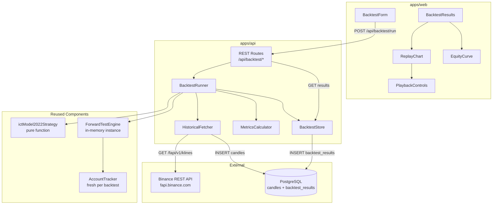

# Design Document — Phase 5.5: Backtesting & Replay

## Overview

This phase adds a full backtesting system and visual replay UI to the ICT Forward Lab. The core design principle is **reuse**: the backtest runner uses the same pure strategy function (`ictModel2022Strategy`) and the same trade execution engine (`ForwardTestEngine`) as the live system. This guarantees behavioral consistency between live forward-testing and historical backtesting.

The system fetches historical candles from Binance REST API, processes them sequentially through the strategy pipeline, collects virtual trades, computes performance metrics, and stores results in PostgreSQL. A replay UI lets traders step through backtests visually with all overlays (FVG, liquidity, signals, trades) appearing at the correct historical time.

### Key Design Decisions

1. **In-memory engine isolation**: Each backtest creates a fresh `ForwardTestEngine` + `AccountTracker` — no shared state with the live instance.
2. **No-repaint guarantee**: The runner only exposes candles that would have been visible at each evaluation point.
3. **Synchronous sequential processing**: Candles are processed one-by-one (no parallelism) to faithfully simulate real-time conditions.
4. **Shared candle storage**: Historical candles go into the existing `candles` table (ON CONFLICT DO NOTHING) — no duplication of schema.
5. **Separate results table**: Backtest trades/metrics stored in `backtest_results` JSONB, never mixed with `forward_trades`.

## Architecture



## Components and Interfaces

### 1. HistoricalFetcher (`apps/api/src/backtest/historical-fetcher.ts`)

Fetches historical candles from Binance REST API with automatic pagination and stores them in the candles table.

```typescript
export interface FetchOptions {
  symbol: string;
  timeframes: string[];  // ["5m", "15m", "1h", "4h"]
  startTime: number;     // Unix ms
  endTime: number;       // Unix ms
}

export class HistoricalFetcher {
  constructor(private pool: Pool);

  /**
   * Fetch and persist all candles for the given range.
   * Paginates automatically (Binance limit = 1000 per request).
   * Skips candles that already exist (ON CONFLICT DO NOTHING).
   * Retries on error with exponential backoff (max 3 attempts).
   */
  async fetchRange(options: FetchOptions): Promise<{ fetched: number; skipped: number }>;

  /**
   * Determine which time ranges need fetching by checking existing candles.
   */
  async findGaps(symbol: string, timeframe: string, startTime: number, endTime: number): Promise<Array<{ start: number; end: number }>>;
}
```

### 2. BacktestRunner (`apps/api/src/backtest/backtest-runner.ts`)

Orchestrates a complete backtest run. Creates isolated engine, processes candles sequentially, collects results.

```typescript
export interface BacktestConfig {
  symbol: string;
  startDate: string;     // ISO date
  endDate: string;       // ISO date
  initialBalance: number;
  riskPerTradePercent: number;
  feePercent: number;
  slippagePercent: number;
  maxOpenTrades: number;
  maxTradesPerDay: number;
  minRiskReward: number;
  tradeTimeoutCandles: number;
}

export interface BacktestProgress {
  totalCandles: number;
  processedCandles: number;
  currentTime: number;
}

export class BacktestRunner {
  constructor(private pool: Pool);

  /**
   * Execute a full backtest. Returns the complete result.
   * Creates isolated ForwardTestEngine + AccountTracker per run.
   * Processes 5m candles chronologically, calling strategy on each close.
   */
  async run(config: BacktestConfig): Promise<BacktestResult>;
}
```

### 3. MetricsCalculator (`apps/api/src/backtest/metrics-calculator.ts`)

Pure functions for computing performance metrics from a trade list.

```typescript
export interface BacktestMetrics {
  totalTrades: number;
  wins: number;
  losses: number;
  breakeven: number;
  winRate: number;         // 0-1
  profitFactor: number;    // gross profit / gross loss, Infinity if no losses
  netPnl: number;
  maxDrawdown: number;     // absolute $
  maxDrawdownPercent: number;  // 0-1
  averageRR: number;
  averageDurationCandles: number;
  bestTrade: number;       // highest PnL
  worstTrade: number;      // lowest PnL
}

export interface EquityPoint {
  time: number;    // Unix ms (trade exit time)
  balance: number;
}

export function calculateMetrics(trades: ForwardTrade[], initialBalance: number): BacktestMetrics;
export function buildEquityCurve(trades: ForwardTrade[], initialBalance: number): EquityPoint[];
```

### 4. BacktestStore (`apps/api/src/backtest/backtest-store.ts`)

Persistence layer for backtest results using the `backtest_results` table.

```typescript
export interface BacktestResult {
  id: string;
  symbol: string;
  startTime: number;
  endTime: number;
  config: BacktestConfig;
  trades: ForwardTrade[];
  metrics: BacktestMetrics;
  equityCurve: EquityPoint[];
  createdAt: number;
}

export interface BacktestSummary {
  id: string;
  symbol: string;
  startTime: number;
  endTime: number;
  tradeCount: number;
  netPnl: number;
  winRate: number;
  createdAt: number;
}

export class BacktestStore {
  constructor(private pool: Pool);

  async save(result: BacktestResult): Promise<string>;  // returns id
  async list(): Promise<BacktestSummary[]>;
  async getById(id: string): Promise<BacktestResult | null>;
}
```

### 5. REST Routes (`apps/api/src/routes/backtest.ts`)

```typescript
// POST /api/backtest/run
//   Body: { startDate, endDate, symbol, config?: Partial<BacktestConfig> }
//   Response: 202 { id: string }

// GET /api/backtest/results
//   Response: 200 BacktestSummary[]

// GET /api/backtest/results/:id
//   Response: 200 BacktestResult | 404
```

### 6. Frontend Components

| Component | Location | Responsibility |
|-----------|----------|----------------|
| `BacktestForm` | `apps/web/components/backtest/BacktestForm.tsx` | Config form with date pickers, validation, submit |
| `BacktestResults` | `apps/web/components/backtest/BacktestResults.tsx` | Metrics cards + trade table |
| `ReplayChart` | `apps/web/components/backtest/ReplayChart.tsx` | Lightweight Charts with candle-by-candle playback |
| `PlaybackControls` | `apps/web/components/backtest/PlaybackControls.tsx` | Play/pause/step/speed buttons |
| `EquityCurve` | `apps/web/components/backtest/EquityCurve.tsx` | Line chart for balance over time |
| `page.tsx` | `apps/web/app/backtest/page.tsx` | Page layout orchestrating all components |

## Data Models

### BacktestConfig

```typescript
interface BacktestConfig {
  symbol: string;              // "BTCUSDT"
  startDate: string;           // "2024-01-01"
  endDate: string;             // "2024-06-30"
  initialBalance: number;      // 10000
  riskPerTradePercent: number;  // 1
  feePercent: number;          // 0.04
  slippagePercent: number;     // 0.02
  maxOpenTrades: number;       // 1
  maxTradesPerDay: number;     // 3
  minRiskReward: number;       // 2
  tradeTimeoutCandles: number; // 24
}
```

### BacktestResult (stored as JSONB in `backtest_results` table)

```typescript
interface BacktestResult {
  id: string;                  // BIGSERIAL from DB
  symbol: string;
  startTime: number;           // Unix ms
  endTime: number;             // Unix ms
  config: BacktestConfig;
  trades: ForwardTrade[];      // Full trade objects from engine
  metrics: BacktestMetrics;
  equityCurve: EquityPoint[];
  createdAt: number;
}
```

### Database Schema

```sql
CREATE TABLE IF NOT EXISTS backtest_results (
  id BIGSERIAL PRIMARY KEY,
  symbol TEXT NOT NULL,
  start_time TIMESTAMPTZ NOT NULL,
  end_time TIMESTAMPTZ NOT NULL,
  config JSONB NOT NULL,
  trades JSONB NOT NULL,
  metrics JSONB NOT NULL,
  equity_curve JSONB NOT NULL,
  created_at TIMESTAMPTZ DEFAULT now()
);
```

### Binance Klines Response Shape

```typescript
// GET https://fapi.binance.com/fapi/v1/klines?symbol=BTCUSDT&interval=5m&startTime=X&endTime=Y&limit=1000
// Response: Array of arrays
type BinanceKline = [
  number,  // open time (ms)
  string,  // open
  string,  // high
  string,  // low
  string,  // close
  string,  // volume
  number,  // close time (ms)
  string,  // quote asset volume
  number,  // number of trades
  string,  // taker buy base asset volume
  string,  // taker buy quote asset volume
  string,  // ignore
];
```

## Correctness Properties

*A property is a characteristic or behavior that should hold true across all valid executions of a system — essentially, a formal statement about what the system should do. Properties serve as the bridge between human-readable specifications and machine-verifiable correctness guarantees.*

### Property 1: Pagination covers full date range

*For any* date range spanning N candles where N > 1000, the HistoricalFetcher SHALL produce requests whose combined time coverage spans the entire [startTime, endTime] range with no gaps between consecutive pages.

**Validates: Requirements 1.2**

### Property 2: No-repaint enforcement

*For any* evaluation point T in a candle sequence, the StrategyContext passed to `ictModel2022Strategy` SHALL contain only candles whose close time is ≤ T. No candle with a close time after T shall appear in any of the context arrays (candles5m, candles15m, candles1h, candles4h).

**Validates: Requirements 2.3**

### Property 3: Multi-timeframe context correctness

*For any* 5m candle close at time T, the StrategyContext SHALL include all closed candles from each timeframe (5m, 15m, 1h, 4h) with close time ≤ T, up to the configured lookback limit per timeframe.

**Validates: Requirements 2.4**

### Property 4: Metrics arithmetic correctness

*For any* list of closed trades with defined PnL and rrResult values, the MetricsCalculator SHALL produce: (a) totalTrades = length of trade list, (b) wins + losses + breakeven = totalTrades, (c) winRate = wins / totalTrades, (d) netPnl = sum of all trade.pnl, (e) averageRR = mean of all trade.rrResult values.

**Validates: Requirements 3.1, 3.4, 3.5, 3.6**

### Property 5: Profit factor calculation

*For any* list of trades with at least one winning and one losing trade, profitFactor SHALL equal sum(positive PnLs) / abs(sum(negative PnLs)). When gross loss is zero, profitFactor SHALL be Infinity.

**Validates: Requirements 3.2**

### Property 6: Max drawdown correctness

*For any* equity curve (sequence of balance values), maxDrawdown SHALL equal the largest decline from any peak to any subsequent trough. maxDrawdownPercent SHALL equal maxDrawdown / peakBalance at the point of maximum decline.

**Validates: Requirements 3.3**

### Property 7: Equity curve construction

*For any* initial balance B and list of trades sorted by exit time, the equity curve SHALL be a time-ordered sequence where equityCurve[0].balance = B and each subsequent point equityCurve[i].balance = equityCurve[i-1].balance + trades[i-1].pnl.

**Validates: Requirements 3.7**

### Property 8: Playback state transitions

*For any* playback position P where P < totalCandles - 1, pressing Step Forward SHALL result in position P + 1. *For any* speed multiplier S in {1, 2, 5, 10}, the auto-advance interval SHALL equal 1000 / S milliseconds.

**Validates: Requirements 7.3, 7.4**

### Property 9: Trade table sort ordering

*For any* list of backtest trades and sort column (PnL, RR, or duration), the displayed table rows SHALL be ordered according to the selected column and direction (ascending or descending).

**Validates: Requirements 9.4**

## Error Handling

| Scenario | Behavior |
|----------|----------|
| Binance API rate limit (429) | Exponential backoff: 1s → 2s → 4s, max 3 retries, then fail with descriptive error |
| Binance API error (5xx) | Same retry strategy as rate limit |
| Invalid date range (start ≥ end) | Return 400 with message "startDate must be before endDate" |
| No candles found for range | Return backtest result with 0 trades and flat equity curve |
| Database connection error during save | Throw error up to route handler, return 500 |
| Backtest result not found by ID | Return 404 |
| Account depleted mid-backtest | Engine stops opening new trades (existing behavior from ForwardTestEngine) |
| Fetch timeout to Binance | 30s request timeout, retried per backoff strategy |

## Testing Strategy

### Property-Based Tests (fast-check)

The MetricsCalculator and BacktestRunner context-building logic are pure functions ideal for PBT. Each property test runs minimum 100 iterations.

- **Library**: `fast-check` (already installed in `apps/api`)
- **Test runner**: `vitest`
- **Location**: `apps/api/src/backtest/__tests__/`

Property tests cover:
- Metrics calculation correctness (Properties 4, 5, 6, 7)
- No-repaint rule enforcement (Property 2)
- Multi-timeframe context construction (Property 3)
- Pagination logic (Property 1)

Configuration:
```typescript
fc.assert(fc.property(
  arbitraryTradeList,
  (trades) => { /* property assertion */ }
), { numRuns: 100 });
```

Tag format: `// Feature: phase5.5-backtesting, Property N: <description>`

### Unit Tests (vitest)

- HistoricalFetcher: retry logic, gap detection
- BacktestRunner: signal passing, onTick/onCandleClosed calls
- REST routes: validation (400 on bad dates), 404 on missing id
- Frontend components: render correct elements, form submission, playback controls

### Integration Tests

- Full backtest run with seeded candle data → verify result structure
- HistoricalFetcher with mocked Binance API → verify pagination
- BacktestStore round-trip: save then retrieve

### Manual Testing

- Visual verification of ReplayChart overlays and trade markers
- Playback timing at different speeds
- Cross-reference backtest results with known historical scenarios
